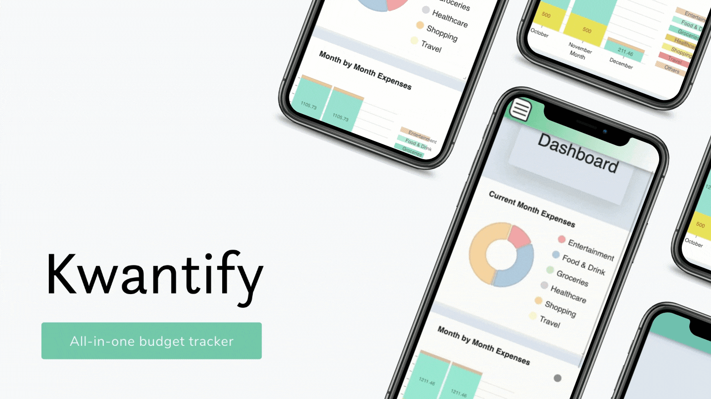

# Welcome to Kwantify

An all-in-one personalized expense and budget tracking app. Kwantify is a cross-platform Progressive Web Application (PWA) that encourages better spending habits and budget tracking. It connects to all your bank accounts, allows you to easily visualize monthly spending, and has a unique receipt scanning feature to record cash transactions. It is built using React, Redux, Node/Express, Nivo, Plaid, Google Cloud Vision and Google Cloud Storage API.


## Deployed App

<a href="https://kwantify.herokuapp.com/"> Kwantify </a>

## Video Demo

<a href='https://www.youtube.com/watch?v=FfP3oItRVoQ&t=1s'> Youtube Video </a>

## Tech-Stack

<table>
      <thead>
        <tr>
          <th>Front End</th>
          <th>Back End</th>
          <th>APIs</th>
          <th>Libraries</th>
        </tr>
      </thead>
      <tbody>
            <tr>
              <td>React</td>
              <td>Node.js</td>
              <td>Plaid</td>
              <td>PWA</td>
            </tr>
            <tr>
              <td>Redux</td>
              <td>Express</td>
              <td>Google Cloud Vision</td>
              <td>Bootstrap</td>
            </tr>
            <tr>
              <td>Nivo.rocks</td>
              <td>PostgreSQL</td>
              <td>Google Cloud Storage</td>
              <td></td>
            </tr>
             <tr>
              <td>HTML & CSS</td>
              <td>Sequelize</td>
              <td></td>
              <td></td>
            </tr>
      </tbody>
  </table>

## Setup

Feel free to clone our repo. To start, please enter the following commands on your terminal:

```
git clone https://github.com/AzirAscenders/Kwantify
cd Kwantify
npm install
npm run start-dev
```

You will need to sign up for API keys with <a href="https://cloud.google.com/free">Google Cloud</a> and set them to process environment variables:

```
process.env.GOOGLE_VISION_API_TOKEN
```

## Our Team

<table>
      <thead>
        <tr>
          <th>Full Name</th>
          <th>GitHub</th>
          <th>LinkedIn</th>
        </tr>
      </thead>
      <tbody>
            <tr>
              <td>Aaron Shen (Tun Oo Swe)</td>
              <td><a href="https://github.com/tunooswe">tunooswe</a></td>
              <td><a href="https://www.linkedin.com/in/tun-oo-swe/">Aaron Shen (Tun Oo Swe)</a></td>
            </tr>
            <tr>
              <td>Nancy Kwan</td>
              <td><a href="https://github.com/nancykwantify">nancykwantify</a></td>
              <td><a href="https://www.linkedin.com/in/nancykwan/">Nancy Kwan<a/></td>
            </tr>
            <tr>
              <td>Seong Jin Kim</td>
              <td><a href="https://github.com/sjkim530">sjkim530</a></td>
              <td><a href="https://www.linkedin.com/in/seongjinkimsjk/">Seong Jin Kim<a/></td>
            </tr>
            <tr>
              <td>Yan Naing Lin</td>
              <td><a href="https://github.com/ynlin98">ynlin98</a></td>
              <td><a href="https://www.linkedin.com/in/yannainglin/">Yan Naing Lin<a/></td>
            </tr>
      </tbody>
  </table>
